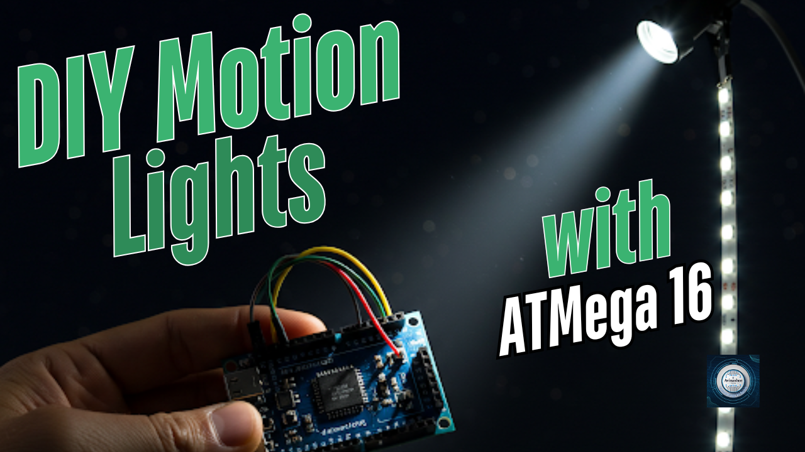
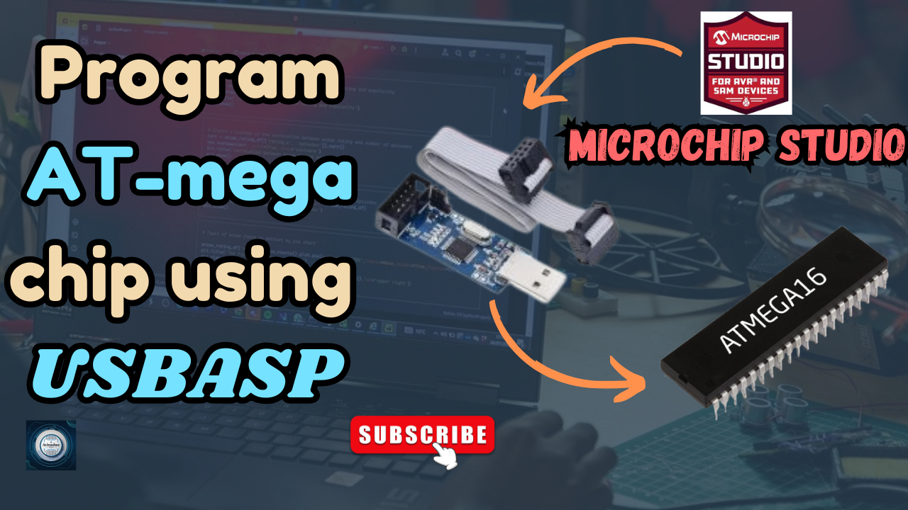

<h1 align="center">
  <a href="https://www.youtube.com/@eccentric_engineer">
	
  </a>  
</h1>

<h3 align="center">
	DIY Motion Lights Nodes using ATMega16A controller 
</h3>


  
## 📝 Overview

Motion Lights project with interconnected nodes of motion sensor.  
Here, two nodes each with it's own Atmega16a mcu, NRF24L01 rf module and PIR sensor are used.  
Data among the nodes are exchanged in Json format. Both nodes can independently detect motions and turn lights on  
as well as send message to other node to turn on lights in advance.  
There is a timeout in seconds for the lights to turn off in case no motion is detected further.  
  
Learn more 👇👇  
  
[](https://youtu.be/OE4tVhNxt_U)

## ✔️ Requirements

### 📦 Hardware
- ATMega16A (main controller)
- nRF24L01 RF Module (for intercommunication amongst nodes)
- PIR sensor (motion sensor to detect movement)
- Relay Module (to turn on lights on motion triggered)
- 5V and 3v3 voltage regulator
- Led strip lights
- USBAsp Programmer (to upload code to chip)

### 📂 Software
- Microchip Studio (for developing code of ATMega16A 👉 https://www.microchip.com/en-us/tools-resources/develop/microchip-studio)
- Json decoder for AVR (https://github.com/MicrochipTech/json_decoder)

## 🛠️ Installation and usage

```sh
git clone https://github.com/AvinasheeTech/Motion_Lights.git
Open Motion_Lights.atsln file in Microchip Studio 
Select main.c file and click on Build->Build Motion_Lights
Next Upload code by clicking on Tools->USBasp
Enjoy...🍹
```
To learn more about how to upload code and create external tool for ATMega16A on Atmel Studio, click link below 👇👇  

[](https://youtu.be/GyCHg1kS4cE)


## ⭐️ Show Your Support

If you find this helpful or interesting, please consider giving us a star on GitHub. Your support helps promote the project and lets others know that it's worth checking out. 

Thank you for your support! 🌟

[](https://github.com/AvinasheeTech/Motion_Lights/stargazers)

